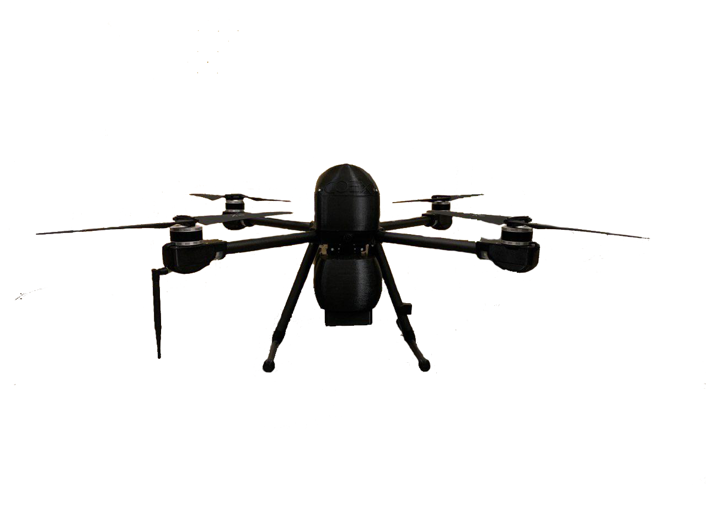

# ДРОН

Дрон Pelikan 3.2 - летательный аппарат не складной конструкции, способный записывать видео с разрешением 4К и делать фотографии с разрешением (вставить разрешение)
Максимальная скорость полета Pelikan 3.2 - 68,4 км/ч (42,5 мили/ч) а максимальное время полёта - 1 час.
(вставить картинку пеликана)

Результат, полученный во время испытаний в безветренной среде и при постоянных скоростях 25 км/ч (15,5 мили/ч). Эти значения приведены исключительно в справочных целях.

## ТЕХНИЧЕСКИЕ ХАРАКТЕРИСТИКИ

## ЧТО В КОМПЛЕКТЕ

1. Квадрокоптер COEX Clever 3, 1 шт
2. Пуль управления FlYSKY, 1 шт
3. Пульт управления Taranis QX7, 1 шт
4. Камера на подвесе Tarrot, 1 шт
5. Блок питания FKS308HSC, 1 шт
6. Блок питания LJH-01262000
7. Пульт управления COEX
8. Зарядное устройство Ultra Power
9. Запасной аккумулятор для квадрокоптера COEX Pelican
10. Аккумулятор для пульта 3S1P
11. Видеоприёмник FOXTECHFPV.COM с монитором LILLIPUT
12. Квадрокоптер COEX Pelican

## ПУЛЬТ УПРАВЛЕНИЯ

В пульт дистанционного управления встроена технология wi-fi, обеспечивающая максимальное растояние передачи сигнала (указать сколько) а так же передачу видео с дрона с разрешением 1080р на небольшом и на 720р на большом расстоянии. Максимальное время работы пульта: (указать сколько)

Пульт дистанционного управления может работать на максимальном расстоянии передачи сигнала на открытом пространстве  без электромагнитных помех при высоте полета около 120 м (400 футов). Максимальное время работы было измерено в лабораторных условиях и приводится исключительно в справочных целях.

## ПЕРЕД ПЕРВЫМ ЗАПУСКОМ

Зарядите аккумуляторы.
Используйте представленное в комплекте зарядное устройство, чтобы полностью зарядить аккумулятор перед использованием.
Подсоедените аккумулятор к зарядному устройству через балансовый и силовой кабель как показано на фото (вставить фото). Время зарядки аккумулятора можно наблюдать на зарядном устройстве. Прочтите инструкцию зарядного устройства перед эксплуатацией.

Аккумулятор пульта управления заряжается через отдельный блок питания. (вставить фото).
ВАЖНО! Для правильной зарядки встроенного планшета -  пульт в момент зарядки должен быть ВКЛЮЧЕН!

## НАЗНАЧЕНИЕ КНОПОК И ЭЛЕМЕНТОВ

### ПОДГОТОВКА ДРОНА

1. Установите дрон на ровном месте на земле. Убедитесь, что пропеллеры на дроне установлены верно, согласно схеме (картинка схемы). Разнесите лопасти пропеллеров в стороны. Произведите визуальный осмотр дрона на предмет деффектов.

2. Включите пульт, зажав на кнопку включения пульта в течение 4 секунд. после этого, если планшет  пульта включен - его экран загорится. Если этого не произошло - зажмите кнопку включения/блокировки планшета 3 секунды.

3. После того как планшет загрузится - на экране появится стандартный экран системы Android.(картинка экрана)
Запустите на экране приложение tetter. Это приложение необходимо для корректной работы пульта с дроном.
(скриншот tetter)
В окне приложения необходимо убедиться, что функция (вставить название функции) включена (она должна быть подсвечена зеленым цветом). Если это не так, - нажмите на эту кнопку 1 раз.

4. После того как планшет загрузится - на экране появится стандартный экран системы Android.(картинка экрана)
 Запустите на экране приложение tetter.
5. Запустите приложение QGroundControl на рабочем столе планшета.

Более исчерпывающая информация по работе с приложением QGroundControl доступно на официальном сайте разработчика: <http://qgroundcontrol.com/>
Не рекомендуется устанавливать дрон на шаткие нестабильные поверхности.

## ПОДГОТОВКА ПОЛЕЗНОЙ НАГРУЗКИ

## АККУМУЛЯТОРЫ

## ПОДГОТОВКА ПУЛЬТА

## ПОЛЁТ

## Предполетная проверка

Перед запуском БПЛА по автономной миссии необходимо выполнить ряд ручных предполетных проверок.

при включении коптера необходимо убедиться в правильном функционировании всех систем, отвечающих за полет:
проверка арма при газу, установленном в минимальное значение необходимо произвести арм коптера, сделать это можно с пульта или же через QGC.

При наличии ошибки “mag sensors inconsistent” необходимо провести калибровку магнитометра:
В QGC в верхней строке меню необходимо выбрать “parameters” (меню с изображением шестеренок), далее выбрать подменю “compass” и следовать инструкциям на экране. коптер необходимо вращать с скоростью 1 оборот в 5 секунд, стараясь удерживать коптер в заданной ориентации, предпочтительно вращаться с коптером стоя, нежели вращать коптер в руках, стоя на месте. сперва берем коптер и удерживаем его в одной из указанных на экране ориентаций, после того ,как ориентация сменит окружение на желтый цвет- начинаем вращать коптер вокруг своей оси, после того как окружение сменится на зеленый- переходим к следующей ориентации. после калибровки необходимо дождаться записи параметров калибровки, обычно это не занимает более 10 секунд.
после проведения всех калибровок коптер необходимо перезагрузить.

При наличии ошибки “high imu accel bias” необходимо подождать минут 10-15. Если ошибка не пропала, необходимо провести калибровку акселерометра: в QGC в верхней строке меню необходимо выбрать “parameters”, далее выбрать подменю “accelerometer” и следовать инструкциям на экране, при этом необходимо учитывать, что в каждой ориентации коптер должен находиться неподвижно, для этого можно использовать вертикальную стену как опору. после включения калибровки необходимо установить коптер в одну из указанных ориентаций и удерживать, пока окружение не сменится на желтый, а затем на зеленый цвет, после калибровки необходимо дождаться записи параметров калибровки, обычно это не занимает более 10 секунд.

PREFLIGHT FAIL: EKF HIGH IMU ACCEL BIAS:
This error is produced when the IMU accelerometer bias estimated by the EKF is excessive.
The check is controlled by the COM_ARM_EKF_AB parameter.

после проведения всех калибровок коптер необходимо перезагрузить.

после калибровок (при необходимости их проведения) необходимо проверить корректность переключения полетных режимов: поочередно переключаем режимы на пульте и проверяем корректность их отображения в QGC. При корректности переключения можно переходить к следующему этапу проверки:
необходимо убедиться в целостности следующих конструктивных элементов:
моторы на лучах и сами лучи не прокручивается, моторы закреплены надежно, люфта при попытке отклонить мотор от продольной оси нет
пропеллеры закреплены надежно, люфта нет
весь визуально наблюдаемый крепеж находится на своих местах, не раскручен
антенны находятся на месте, закручены надежно
стойка GPS не прокручивается
корпус коптера не имеет трещин и сколов
карбоновые трубки лучей гладкие, не имеют трещин
контактные площадки закреплены надежно, не прокручиваются

взлет в ручном режиме. для этого необходимо вынести коптер на открытую, горизонтальную и ровную площадку размерами не менее 5х5 метров, свободную от посторонних предметов, пыли, людей, животных, без нависающих над местом взлета козырьков, навесов, проводов. переводим переключатель полетных режимов в положение stabilized, производим ARM и постепенно увеличиваем тягу пока коптер не начнет отрываться от земли. поднимаемся на высоту 2-3 метров и плавными и аккуратными движениями отклоняем правый стик на 1-5 градусов в каждом из направлений, при адекватной и предсказуемой реакции необходимо посадить коптер: плавно опускаем ручку газа, пока коптер не начнет снижаться, после касания шасси земли опускаем ручку газа, пока шасси не окажется полностью на земле, после чего опускаем ручку газа до нуля, дизармим.
если коптер в воздухе ведет себя неестественно, осциллирует- следует немедленно его посадить, после чего проверить консоль QGC на наличие ошибок
переводим полетный режим в положение altitude, в этом режиме коптер удерживает высоту при положении ручку газа в среднем положении, при положении ручки ниже среднего положения он снижается с заданной заранее скоростью, при положении ручки газа выше среднего положения коптер набирает высоту с заданной программно скоростью. если при следующих манипуляциях коптер начнет неконтролируемо набирать высоту- следует перевести ручку газа в среднее положение одновременно с переключением полетного режима в положение STABILIZED и немедленно посадить. Производим ARM, поднимаем ручку газа до среднего положения, после чего аккуратно поднимаем ее выше, пока коптер не начнет набирать высоту, поднимаемся до 2-3 метров, возвращаем ручку газа в среднее положение, если коптер удерживает высоту, не снижается и не поднимается более чем на 1 метр при неподвижной ручке газа- опускаем ручку пока коптер не начнет снижаться, после касания шасси земли опускаем ручку газа до нуля, дизармим.

если коптер в воздухе ведет себя неестественно, осциллирует- следует немедленно его посадить, после чего проверить консоль QGC на наличие ошибок и проверить элементы шасси, корпуса, пропеллеров на надежность крепления.

переводим полетный режим в положение position, в этом режим коптер удерживает высоту и точку в пространстве при положении ручку газа в среднем положении, при положении ручки ниже среднего положения он снижается с заданной заранее скоростью, при положении ручки газа выше среднего положения коптер набирает высоту с заданной программно скоростью. если при следующих манипуляциях коптер начнет неконтролируемо набирать высоту или быстро ускоряться и двигаться в сторону, куда его не направляют командами с пульта- следует перевести ручку газа в среднее положение одновременно с переключением полетного режима в положение STABILIZED и немедленно посадить. Производим ARM, поднимаем ручку газа до среднего положения, после чего аккуратно поднимаем ее дальше, пока коптер не начнет набирать высоту, поднимаемся до 2-3 метров, возвращаем ручку газа в среднее положение, если коптер удерживает высоту, не снижается и не поднимается более чем на 1 метр - плавными и аккуратными движениями отклоняем правый стик на 1-5 градусов в каждом из направлений, при адекватной и предсказуемой реакции необходимо посадить коптер: плавно опускаем ручку газа, пока коптер не начнет снижаться, после касания шасси земли опускаем ручку пока коптер не начнет снижаться, после касания шасси земли опускаем ручку газа до нуля, дизармим. если коптер в воздухе ведет себя неестественно, осциллирует- следует немедленно его посадить, после чего проверить консоль QGC на наличие ошибок

## Популярные вопросы по эксплуатации

### Сколько способов управления Pelikan существует и как их менять

### Водонепроницаем ли

### Какие карты Micro SD поддерживает

### Можно ли использовать HDMI кабель для подключения пульта к телевизору

### Можно ли использовать wi-fi для удаленного подключения

### Требуется ли снимать пропеллеры перед транспортировкой

### Ветер какой силы должен выдерживать Pelikan

### Чему равна максимальная высота Pelikan над уровнем моря

### Сколько времени уходит на полную зарядку аккумулятора

### Как часто следует полностью заряжать аккумуляторы

### Как можно обновлять прошивки на квадрокоптер и пульт

### Чему равен радиус управления Pelikan

### В каком разрешении транслируется видеопоток Pelikan

### С какой задержкой транслируется видеопоток Pelikan

### Можно ли переключаться между частотами
